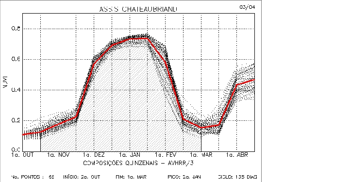

# NDVI-EVI

## Proposta:
>- Identifique uma região que contenha área de vegetação sob manejo e vegetação natural.
>- Construa um gráfico temporal (valor do Índice no Y e dias ou meses no X) comparando para a area escolhida os produtos EVI e NDVI do Landsat 8.
>- Inicialmente para um ano e depois multi anual.

Diante da proposta e da abordagem do exercicio, desmembrar a resolução se torna essencial para a compreensão de escolhas da abordagem.

### Fórmulas:
[NDVI (Indice de vegetação por diferença normalizada)](https://en.wikipedia.org/wiki/Normalized_difference_vegetation_index) : $NDVI = \frac{\rho_{nir} - \rho_{red}}{\rho_{nir} + \rho_{red}}$

Onde 

$\rho_{nir}$ = reflectância na banda infravermelho próximo

$\rho_{red}$ = reflectância na banda vermelho

> NDVI tem como diversas ultilidades, a ultilizada no estudo, é a mudança sazionais e interanuais de vegetações 
[Referencia: John R. Jensen - Sensoriamento Remoto do Ambiente ](https://libgen.is/book/index.php?md5=231A0EB2C386CB0B55510D6DC1CC269F)

[EVI (Indice de vegetação realçado)](https://en.wikipedia.org/wiki/Enhanced_vegetation_index)$$EVI = \frac{G(L+1){\rho_{nir}-\rho_{red}}}{\rho_{nir}+C_1\rho_{red}-C_2\rho_{blue}+L}$$

Onde

$\rho_{nir}$ = reflectância na banda do infravermelho próximo

$\rho_{red}$ = reflectância na banda do vermelho

$\rho_{blue}$ = reflectância na banda do azul

$G, L, C_1, C_2 = 2.5, 1, 6, 7.5$
respectivamente

>O EVI é um NDVI modificado, contendo um fator de ajuste para solos (L), e dois coeficientes $(C_1; e C_2)$,
>que descrevem o uso da banda azul para correção da banda vermelha quanto ao espalhamento atmosférico por aerossóis.[Referencia: John R. Jensen - Sensoriamento Remoto do Ambiente](https://libgen.is/book/index.php?md5=231A0EB2C386CB0B55510D6DC1CC269F)

---

Estudo de casos:
## Coordenadas do primeiro roi (poligono de 18 vértices)
0: [-47.44435588367599,-18.0477656358583]
1: [-47.44360486515182,-18.048622514575573]
2: [-47.442489066201624,-18.049234568245566]
3: [-47.440944113809046,-18.04962220113458]
4: [-47.43959228046554,-18.049601799424885]
5: [-47.43791858204025,-18.049132559448527]
6: [-47.43637362964767,-18.04788804735929]
7: [-47.4356226111235,-18.046704732613538]
8: [-47.435193457681116,-18.045235779092874]
9: [-47.435450949746546,-18.043685203732046]
10: [-47.4361805105986,-18.042053004373592]
11: [-47.43742505558151,-18.04091045581095]
12: [-47.439248957711634,-18.040175956387653]
13: [-47.44154492862838,-18.040114747963937]
14: [-47.44326154239791,-18.040869650367885]
15: [-47.444720664102014,-18.042379445456966]
16: [-47.44538585193771,-18.044215665262307]
17: [-47.44506398685592,-18.046500712024976]
18: [-47.44435588367599,-18.0477656358583]

Primeiro roi considerado se localiza na região suldeste de Goiânia, com a cidade mais proxima localizada a noroeste do roi, chamada Santo Antônio do Rio verde, [com aproximadademente 3000 habitantes](https://pt.wikipedia.org/wiki/Santo_Antônio_do_Rio_Verde). Tal cidade é um importante produtor de grãos, sobretudo soja. Ao efetuarmos uma série temporal do NDVI e EVI calculados com a média dos pixels de cada imagem da coleção do landsat-8 no roi (entre os períodos de 01/05/2021 - 01/05/2022 [para o NDVI] e 01/05/2018 - 01/05/2022 (para o EVI)) obtemos os seguintes gráficos:

---

> Série temporal do NDVI e EVI no período de um ano img(1)

---

> Série temporal do NDVI e EVI no período de quarto anos img(2)

## Comparação do EVI e NDVI com gráfico de outra região (Pará-Assis) para o mesmo tipo de plantío.

[Gráfico multitemporal do município de Assis no Pará img(3) ref.:](https://www.researchgate.net/publication/228436582_Uso_de_perfis_multi-tempoais_de_NDVIAVHRR_no_acompanhamento_da_cultura_da_soja_no_oeste_do_Parana)

## Similaridades nos seguintes aspectos dos gráficos 1,3:
* Mínimo em outubro,
* Máximos em novembro, abril/junho
* 2 safras aparentes

## Clima primeiro roi
>A caracterização do clima de Goias é tropical, caracterizado por verões chuvosos e invernos secos. Com temperaturas médias anuais que variam entre 23°C no >norte e 20 °C no sul (região do objeto de estudo).
[ref.:](https://www.goias.gov.br/conheca-goias/geografia.html#:~:text=O%20clima%20em%20Goiás%20é,Norte%2C%20e%2020ºC%20ao%20Sul.)

---

### Estações do ano e períodos de chuva Goiânia:
* Outono - começo/fim: 20 de março - 20 de junho; Períodos médias de chuvas de média para cima - 20 de março até 15 de abril.
* Inverno - começo/fim: 21 de junho até 23 de setembro; Períodos médias de chuvas de média para cima - Não possui.
* Primavera - começo/fim: 23 de setembro até 22 de dezembro; Períodos médias de chuvas de média para cima - 1 de outubro até 22 de dezembro
* Verão - começo/fim: 22 de dezembro até 20 de março; Períodos médias de chuvas de média para cima - Possui boas médias de chuva em toda a estação

[fig(4) - ref.:](https://pt.weatherspark.com/y/29864/Clima-característico-em-Goiás-Brasil-durante-o-ano)

---

# Conclusão para o primeiro roi
> Dado os apontamentos vistos anteriormente, conclui-se que roi possui pluviozidade, temperatura e recursos hidricos necessário para o plantio de soja. Tal fato se concretiza, ao analizarmos gráficos de EVI e NDVI de outras regiões, que possuem o mesmo tipo de comportamento com a mesma cultura no local de manejo analisado.

## Coordenadas do segundo roi (poligono de 4 vértices):
0: [-43.52789597113878,-23.037408348219056]
1: [-43.524312539894886,-23.037408348219056]
2: [-43.524312539894886,-23.034426606849667]
3: [-43.52789597113878,-23.034426606849667]
4: [-43.52789597113878,-23.037408348219056]

### Area de preservação natural (Mata atlântica)
> Roi localizado ao oeste da cidade do rio de janeiro, cidade tal com aproximadamente [6.7 milhões de habitantes](https://cidades.ibge.gov.br/brasil/rj/rio-de-janeiro/panorama). Ao efetuarmos serie temporal da média de EVI e NDVI do segundo roi, se torna notável que suas cristas e vales são muito menos constantes e exclusivamente dependentes da pluviosidade do local estudado. como mostrado no fig(7) e fig(5).

